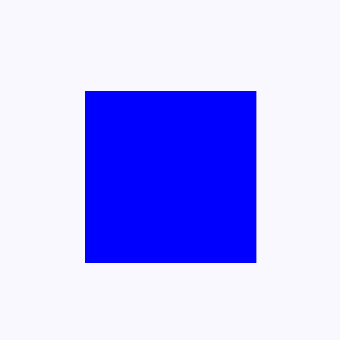
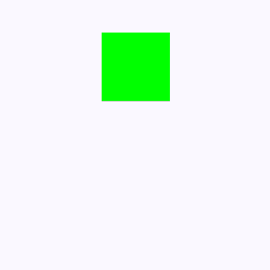
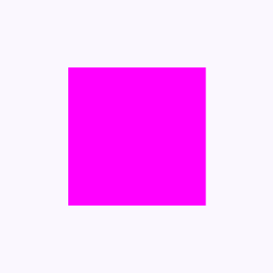
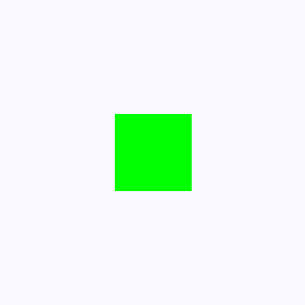
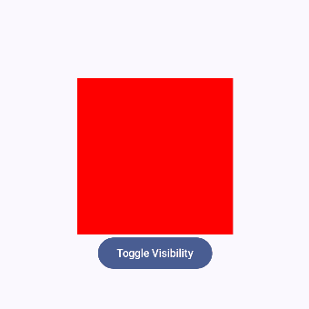
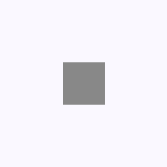

Вот несколько примеров простых компонентов на Jetpack Compose, демонстрирующих основные виды анимации:  

## Анимации изменения состояния (animate*AsState)

В данную группу анимаций входит набор методов, который позволяет изменять значения переменных, таких как цвет, размер, отсупы и др. в зависимости состояния объектов

### 1. `animateColorAsState`
Эта анимация изменяет цвет элемента плавно при смене состояния.

```kotlin
@Composable
fun ColorAnimationExample() {
    var isRed by remember { mutableStateOf(true) }
    val color by animateColorAsState(
        targetValue = if (isRed) Color.Red else Color.Blue,
        animationSpec = tween(durationMillis = 1000)
    )

    Box(
        modifier = Modifier
            .size(200.dp)
            .background(color)
            .clickable { isRed = !isRed }
    )
}
```

- `animateColorAsState` отслеживает изменение целевого цвета и анимирует переход.  
- `tween(durationMillis = 1000)` задаёт линейную интерполяцию в 1 секунду (длительность анимации).  
- При клике цвет переключается между красным и синим.  



---

### 2. `animateDpAsState`
Этот пример изменяет положение объекта по вертикали.

```kotlin
@Composable
fun OffsetAnimationExample() {
    var moved by remember { mutableStateOf(false) }
    val offsetY by animateDpAsState(
        targetValue = if (moved) 100.dp else (-100).dp,
        animationSpec = spring(dampingRatio = Spring.DampingRatioMediumBouncy)
    )

    Box(
        modifier = Modifier
            .size(100.dp)
            .offset(y = offsetY)
            .background(Color.Green)
            .clickable { moved = !moved }
    )
}
```

- `animateDpAsState` анимирует изменение смещения (`offsetY`).  
- Используется `spring()` для эффекта упругости.  
- При клике объект перемещается на 200.dp вправо и обратно.  



---

### 3. `animateFloatAsState`
В этом примере круг плавно вращается.

```kotlin
@Composable
fun RotationAnimationExample() {
    var rotated by remember { mutableStateOf(false) }
    val rotation by animateFloatAsState(
        targetValue = if (rotated) 360f else 0f,
        animationSpec = tween(durationMillis = 1000, easing = LinearEasing)
    )

    Box(
        modifier = Modifier
            .size(200.dp)
            .graphicsLayer(rotationZ = rotation)
            .background(Color.Magenta)
            .clickable { rotated = !rotated }
    )
}
```
- `animateFloatAsState` анимирует изменение угла поворота `rotationZ`.  
- `tween()` обеспечивает плавное вращение за 1 секунду.
- `easing` определяет функцию плавности, которая может определять ускорение или замедление течения анимации.
- При клике объект вращается на 360 градусов.  



---

Также для параметра `animationSpec` можно устанавливать значения в виде набора ключевых кадров при помощи функции `keyframes` 

```kotlin
@Composable
fun ScaleKeyframesAnimationExample() {
    var scaled by remember { mutableStateOf(false) }
    val scaling by animateFloatAsState(
        targetValue = if (scaled) 1f else 0.5f,
        animationSpec = keyframes {
            durationMillis = 1000
            if (scaled) {
                0.6f at 100
                1.2f at 500
                1f at 800
            }
        }
    )
    Box(
        modifier = Modifier
            .size(200.dp)
            .graphicsLayer(scaleX = scaling, scaleY = scaling)
            .background(Color.Green)
            .clickable { scaled = !scaled }
    )
}
```
- значения ключевых кадров задаются в формате `параметр_анимации at время`



## Анимация появления/исчезновения (`AnimatedVisibility`)
Объект плавно появляется и исчезает при нажатии кнопки.
Важно отметить, что в качестве одного из параметров данная функция принимает объект, который необходимо анимировать

```kotlin
@Composable
fun VisibilityAnimationExample() {
    var isVisible by remember { mutableStateOf(true) }

    Column(
        verticalArrangement = Arrangement.Bottom ,
        horizontalAlignment = Alignment.CenterHorizontally,
        modifier = Modifier.height(300.dp)
    ) {
        AnimatedVisibility(
            visible = isVisible,
            enter = fadeIn(animationSpec = tween(500)),
            exit = fadeOut(animationSpec = tween(500))
        ) {
            Box(
                modifier = Modifier
                    .size(200.dp)
                    .background(Color.Red)
            )
        }
        Button(onClick = { isVisible = !isVisible }) {
            Text("Toggle Visibility")
        }
    }
}
```

- `AnimatedVisibility` управляет появлением/исчезновением.  
- `fadeIn()` и `fadeOut()` создают эффект плавного изменения прозрачности.  



---

Помимо `fadeIn()` и `fadeOut()` можно использовать и другие анимации входа и выхода, а также их комбинации

**[Больше примеров базовых анимаций входа и выхода](https://developer.android.com/develop/ui/compose/animation/composables-modifiers#enter-exit-transition)**

```kotlin
@Composable
fun VisibilityAnimationExample() {
    var isVisible by remember { mutableStateOf(true) }

    Column(
        verticalArrangement = Arrangement.Bottom ,
        horizontalAlignment = Alignment.CenterHorizontally,
        modifier = Modifier.height(300.dp)
    ) {
        AnimatedVisibility(
            visible = isVisible,
            enter = slideInHorizontally() + expandHorizontally(expandFrom = Alignment.CenterHorizontally)
                    + fadeIn(),
            exit = slideOutHorizontally(targetOffsetX = { fullWidth -> fullWidth })
                    + shrinkHorizontally() + fadeOut(),
        ) {
            Box(
                modifier = Modifier
                    .size(200.dp)
                    .background(Color.Red)
            )
        }
        Button(onClick = { isVisible = !isVisible }) {
            Text("Toggle Visibility")
        }
    }
}
```
- `slideInHorizontally() + expandHorizontally()` создают эффект плавного выхода и растягивания объекта.  
- `slideOutHorizontally() + shrinkHorizontally()` создают эффект плавного ухода и сжатия объекта.  


## Анимация с ключевыми кадрами (`updateTransition`)
Позволяет создавать сложные анимации с несколькими параметрами.

```kotlin
@Composable
fun TransitionAnimationExample() {
    var isExpanded by remember { mutableStateOf(false) }
    val transition = updateTransition(targetState = isExpanded, label = "Box Transition")

    val size by transition.animateDp(label = "Size") { state ->
        if (state) 150.dp else 100.dp
    }
    val color by transition.animateColor(label = "Color") { state ->
        if (state) Color.Yellow else Color.Gray
    }

    Box(
        modifier = Modifier
            .size(size)
            .background(color)
            .clickable { isExpanded = !isExpanded }
    )
}
```

- `updateTransition` управляет несколькими анимациями одновременно.  
- `animateDp` изменяет размер, а `animateColor` — цвет.  
- При клике изменяются оба параметра.  

