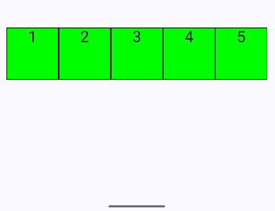
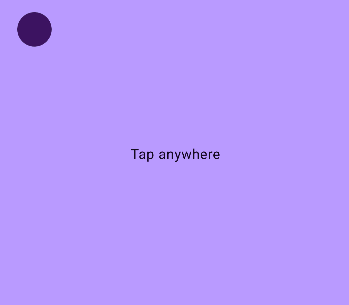

# Анимации

Для применения анимации в приложении Jetpack Compose предоставляет специальный API - Animation API. Этот API состоит из классов и функций, которые предоставляют широкие возможности по созданию анимации. Рассмотрим ключевые функции и классы Animation API.

Так, Compose Animation API предоставляет ряд анимаций состояния компонентов. В частности, это функции анимации для значений типов Bounds, Color, Dp, Float, Int, IntOffset, IntSize, Offset, Rect и Size. Подобные функции покрывают большинство потребностей в анимации компонентов.
## Анимации изменения состояния (animate*AsState)

В данную группу анимаций входит набор методов, который позволяет изменять значения переменных, таких как цвет, размер, отсупы и др. в зависимости состояния объектов

В функции передается целевое (конечное) значение, которое должно получить состояние. И функции анимируют переход от текущего значения к целевому.
### 1. `animateColorAsState`
Эта анимация изменяет цвет элемента плавно при смене состояния.

```kotlin
@Composable
fun ColorAnimationExample() {
    var isRed by remember { mutableStateOf(true) }
    val color by animateColorAsState(
        targetValue = if (isRed) Color.Red else Color.Blue,
        animationSpec = tween(durationMillis = 1000)
    )

    Box(
        modifier = Modifier
            .size(200.dp)
            .background(color)
            .clickable { isRed = !isRed }
    )
}
```

- `animateColorAsState` отслеживает изменение целевого цвета и анимирует переход.  
- `tween(durationMillis = 1000)` задаёт линейную интерполяцию в 1 секунду (длительность анимации).  
- При клике цвет переключается между красным и синим.  


---

### 2. `animateDpAsState`
Этот пример изменяет положение объекта по вертикали.

```kotlin
@Composable
fun OffsetAnimationExample() {
    var moved by remember { mutableStateOf(false) }
    val offsetY by animateDpAsState(
        targetValue = if (moved) 100.dp else (-100).dp,
        animationSpec = spring(dampingRatio = Spring.DampingRatioMediumBouncy)
    )

    Box(
        modifier = Modifier
            .size(100.dp)
            .offset(y = offsetY)
            .background(Color.Green)
            .clickable { moved = !moved }
    )
}
```

- `animateDpAsState` анимирует изменение смещения (`offsetY`).  
- Используется `spring()` для эффекта упругости.  
- При клике объект перемещается на 200.dp вправо и обратно.  


---

### 3. `animateFloatAsState`
В этом примере круг плавно вращается.

```kotlin
@Composable
fun RotationAnimationExample() {
    var rotated by remember { mutableStateOf(false) }
    val rotation by animateFloatAsState(
        targetValue = if (rotated) 360f else 0f,
        animationSpec = tween(durationMillis = 1000, easing = LinearEasing)
    )

    Box(
        modifier = Modifier
            .size(200.dp)
            .graphicsLayer(rotationZ = rotation)
            .background(Color.Magenta)
            .clickable { rotated = !rotated }
    )
}
```
- `animateFloatAsState` анимирует изменение угла поворота `rotationZ`.  
- `tween()` обеспечивает плавное вращение за 1 секунду.
- `easing` определяет функцию плавности, которая может определять ускорение или замедление течения анимации.
- При клике объект вращается на 360 градусов.  


---

В качестве значения функция `easing` примнимает одно из значений, определяющих течение анимации
1. LinearEasing
2. FastOutSlowInEasing
3. FastOutLinearEasing
4. LinearOutSlowInEasing
5. CubicBezierEasing



```kotlin
@Composable
fun EasingAnimationExample() {
    var moved by remember { mutableStateOf(false) }
    val offsetLinear by animateDpAsState(
        targetValue = if (moved) 100.dp else (-100).dp,
        animationSpec = tween(durationMillis = 5000, easing = LinearEasing)
    )
    val offsetLinearOutSlowIn by animateDpAsState(
        targetValue = if (moved) 100.dp else (-100).dp,
        animationSpec = tween(durationMillis = 5000, easing = LinearOutSlowInEasing)
    )
    val offsetFastOutLinearIn by animateDpAsState(
        targetValue = if (moved) 100.dp else (-100).dp,
        animationSpec = tween(durationMillis = 5000, easing = FastOutLinearInEasing)
    )
    val offsetFastOutSlowIn by animateDpAsState(
        targetValue = if (moved) 100.dp else (-100).dp,
        animationSpec = tween(durationMillis = 5000, easing = FastOutSlowInEasing)
    )
    val offsetCubicBezier by animateDpAsState(
        targetValue = if (moved) 100.dp else (-100).dp,
        animationSpec = tween(durationMillis = 5000, easing = CubicBezierEasing(0f, 1f, 0.5f,1f))
    )
    Row {
        EasingBox(
            text = "1",
            offset = offsetLinear,
            modifier = Modifier.clickable { moved = !moved }
        )
        EasingBox(
            text = "2",
            offset = offsetFastOutSlowIn,
            modifier = Modifier.clickable { moved = !moved }
        )
        EasingBox(
            text = "3",
            offset = offsetFastOutLinearIn,
            modifier = Modifier.clickable { moved = !moved }
        )
        EasingBox(
            text = "4",
            offset = offsetLinearOutSlowIn,
            modifier = Modifier.clickable { moved = !moved }
        )
        EasingBox(
            text = "5",
            offset = offsetCubicBezier,
            modifier = Modifier.clickable { moved = !moved }
        )
    }
}
@Composable
fun EasingBox(text:String, offset: Dp, modifier: Modifier){
    Text(
        text = text,
        textAlign = TextAlign.Center,
        fontSize = 30.sp,
        modifier = Modifier
            .size(100.dp)
            .offset(y = offset)
            .background(Color.Green)
            .border(1.dp, color = Color.Black)
            .then(modifier)
    )
}
```


---

Также для параметра `animationSpec` можно устанавливать значения в виде набора ключевых кадров при помощи функции `keyframes` 

```kotlin
@Composable
fun ScaleKeyframesAnimationExample() {
    var scaled by remember { mutableStateOf(false) }
    val scaling by animateFloatAsState(
        targetValue = if (scaled) 1f else 0.5f,
        animationSpec = keyframes {
            durationMillis = 1000
            if (scaled) {
                0.6f at 100
                1.2f at 500
                1f at 800
            }
        }
    )
    Box(
        modifier = Modifier
            .size(200.dp)
            .graphicsLayer(scaleX = scaling, scaleY = scaling)
            .background(Color.Green)
            .clickable { scaled = !scaled }
    )
}
```
- значения ключевых кадров задаются в формате `параметр_анимации at время`


## Анимации Animatable
`Animatable` это значение, которое автоматически анимируется при изменении значения с помощью `animateTo`. Если `animateTo` вызывается во время текущей анимации изменения значения, новая анимация будет переходить `Animatable` от текущего значения (т. е. значения в момент прерывания) к новому `targetValue`.

При определении такой анимации задается специальный конвертор, преобразующий значение в вектор анимации

При этом вызов animateTo должен осуществлятся в контексте корутины, так как данные анимации обрабатываются отдельно и имеют возможность прерывания.

```kotlin
@Composable
fun OffsetAnimation() {
    val animatedOffset = remember { Animatable(initialValue = Offset(0f,0f), typeConverter = Offset.VectorConverter) }

    Box(
        Modifier.fillMaxSize().background(Color(0xffb99aff)).pointerInput(Unit) {
            coroutineScope {
                while (true) {
                    val offset = awaitPointerEventScope { awaitFirstDown().position }
                    // Launch a new coroutine for animation so the touch detection thread is not
                    // blocked.
                    launch {
                        // Animates to the pressed position, with the given animation spec.
                        animatedOffset.animateTo(
                            offset,
                            animationSpec = spring(stiffness = Spring.StiffnessLow)
                        )
                    }
                }
            }
        }
    ) {
        Text("Tap anywhere", Modifier.align(Alignment.Center))
        Box(
            Modifier.offset {
                // Use the animated offset as the offset of the Box.
                IntOffset(
                    animatedOffset.value.x.roundToInt(),
                    animatedOffset.value.y.roundToInt()
                )
            }
                .size(40.dp)
                .background(Color(0xff3c1361), CircleShape)
        )
    }
}
```


## Анимация появления/исчезновения (`AnimatedVisibility`)
Объект плавно появляется и исчезает при нажатии кнопки.
Важно отметить, что в качестве одного из параметров данная функция принимает объект, который необходимо анимировать

```kotlin
@Composable
fun VisibilityAnimationExample() {
    var isVisible by remember { mutableStateOf(true) }

    Column(
        verticalArrangement = Arrangement.Bottom ,
        horizontalAlignment = Alignment.CenterHorizontally,
        modifier = Modifier.height(300.dp)
    ) {
        AnimatedVisibility(
            visible = isVisible,
            enter = fadeIn(animationSpec = tween(500)),
            exit = fadeOut(animationSpec = tween(500))
        ) {
            Box(
                modifier = Modifier
                    .size(200.dp)
                    .background(Color.Red)
            )
        }
        Button(onClick = { isVisible = !isVisible }) {
            Text("Toggle Visibility")
        }
    }
}
```

- `AnimatedVisibility` управляет появлением/исчезновением.  
- `fadeIn()` и `fadeOut()` создают эффект плавного изменения прозрачности.  


---

Помимо `fadeIn()` и `fadeOut()` можно использовать и другие анимации входа и выхода, а также их комбинации

- `expandHorizontally()`: содержимое отображается с использованием метода горизонтального отсечения. Позволяет указать, какая часть контента изначально отображается до начала анимации.

- `expandVertically()`: содержимое отображается с использованием техники вертикального отсечения. Позволяет указать, какая часть контента изначально отображается до начала анимации.

- `expandIn()`: содержимое отображается с использованием методов горизонтального и вертикального отсечения. Позволяет указать, какая часть контента изначально отображается до начала анимации.

- `fadeIn()`: постепенно делает прозрачное содержимое непрозрачным. Начальная прозрачность может быть объявлена с использованием значения с плавающей запятой от 0 до 1.0. Значение по умолчанию - 0.

- `fadeOut()`: постепенно делает непрозрачное содержимое прозрачным (невидимым). Целевая прозрачность перед исчезновением содержимого может быть объявлена с использованием значения с плавающей запятой от 0 до 1.0. Значение по умолчанию - 0.

- `scaleIn()`: содержимое постепенно увеличивается. По умолчанию содержимое начинается с нулевого размера и расширяется до полного размера, хотя это значение по умолчанию можно изменить, указав начальное значение масштаба как плавающее значение от 0 до 1.0.

- `scaleOut()`: содержимое постепенно уменьшается и в конце полностью исчезает. По умолчанию целевой масштаб равен 0, но его можно настроить с использованием плавающего значения от 0 до 1.0.

- `shrinkHorizontally()`: компонент постепенно сживается по горизонтали, пока польностью не исчезнет.

- `shrinkVertically()`: компонент постепенно сживается по вертикали, пока польностью не исчезнет.

- `shrinkOut()`: ккомпонент постепенно сживается по горизонтали и вертикали, пока польностью не исчезнет.

- `slideInHorizontally()`: содержимое перемещается в область обзора вдоль горизонтальной оси

- `slideInVertically()`: содержимое перемещается в область обзора вдоль вертикальной оси.

- `slideIn()`: содержимое появляется в области обзора под настраиваемым углом, определяемым через начальное значение смещения.

- `slideOut()`: содержимое исчезает из поля зрения под настраиваемым углом, определяемым через начальное значение смещения.

- `slideOutHorizontally()`: содержимое выходит из области обзора вдоль горизонтальной оси.

- `slideOutVertically()`: содержимое выходит из поля зрения вдоль вертикальной оси

**[Больше примеров базовых анимаций входа и выхода](https://developer.android.com/develop/ui/compose/animation/composables-modifiers#enter-exit-transition)**

```kotlin
@Composable
fun VisibilityAnimationExample() {
    var isVisible by remember { mutableStateOf(true) }

    Column(
        verticalArrangement = Arrangement.Bottom ,
        horizontalAlignment = Alignment.CenterHorizontally,
        modifier = Modifier.height(300.dp)
    ) {
        AnimatedVisibility(
            visible = isVisible,
            enter = slideInHorizontally() + expandHorizontally(expandFrom = Alignment.CenterHorizontally)
                    + fadeIn(),
            exit = slideOutHorizontally(targetOffsetX = { fullWidth -> fullWidth })
                    + shrinkHorizontally() + fadeOut(),
        ) {
            Box(
                modifier = Modifier
                    .size(200.dp)
                    .background(Color.Red)
            )
        }
        Button(onClick = { isVisible = !isVisible }) {
            Text("Toggle Visibility")
        }
    }
}
```
- `slideInHorizontally() + expandHorizontally()` создают эффект плавного выхода и растягивания объекта.  
- `slideOutHorizontally() + shrinkHorizontally()` создают эффект плавного ухода и сжатия объекта.  


## Анимация с ключевыми кадрами (`updateTransition`)
Позволяет создавать сложные анимации с несколькими параметрами.

Иногда возникает необходимость запустить не одну, а сразу несколько анимаций. Для этой цели в Jetpack Compose применяется Transition, к которому можно добавить несколько дочерних анимаций и запустить их одновременно.

Для создания объекта который позволяет запускать несколько анимаций параллельно на основе одного целевого состояния используется функция updateTransition(). Эта функция передает целевое состояние и возвращает объект Transition, к которому можно добавить несколько дочерних анимаций.

В качестве обязательного параметра targetState функции надо передать целевое состояние. Когда целевое состояние изменится, объект Transition запустит все дочерние анимации одновременно.

```kotlin
@Composable
fun TransitionAnimationExample() {
    var isExpanded by remember { mutableStateOf(false) }
    val transition = updateTransition(targetState = isExpanded, label = "Box Transition")

    val size by transition.animateDp(label = "Size") { state ->
        if (state) 150.dp else 100.dp
    }
    val color by transition.animateColor(label = "Color") { state ->
        if (state) Color.Yellow else Color.Gray
    }

    Box(
        modifier = Modifier
            .size(size)
            .background(color)
            .clickable { isExpanded = !isExpanded }
    )
}
```

- `updateTransition` управляет несколькими анимациями одновременно.  
- `animateDp` изменяет размер, а `animateColor` — цвет.  
- При клике изменяются оба параметра.  


## Бесконечная анимация (`infiniteTransition`)

Иногда требуется создать анимацию, которая будет выполняться бесконечно, например, для эффектов мерцания, пульсации или циклического движения. В Jetpack Compose для этой цели используется `InfiniteTransition`, позволяющий запускать несколько бесконечных анимаций одновременно.

Для создания такого объекта применяется функция `rememberInfiniteTransition()`, которая возвращает экземпляр `InfiniteTransition`. К этому объекту можно добавить несколько анимаций, которые будут выполняться в цикле без остановки.

В качестве базовой функции для анимации используется `animateFloat`, `animateValue` или другие аналогичные функции, принимающие параметры `tween`, `keyframes` или `repeatable`, позволяющие гибко настроить поведение бесконечной анимации.

Таким образом, `InfiniteTransition` идеально подходит для создания динамических визуальных эффектов, работающих на протяжении всего времени существования композиции.

```kotlin
@Composable
fun InfinitelyPulsingHeart() {
    val infiniteTransition = rememberInfiniteTransition()
    val scale by
    infiniteTransition.animateFloat(
        initialValue = 3f,
        targetValue = 6f,
        animationSpec =
        infiniteRepeatable(
            animation = tween(1000),
            repeatMode = RepeatMode.Restart
        )
    )
    val color by
    infiniteTransition.animateColor(
        initialValue = Color.Red,
        targetValue = Color(0xff800000),
        animationSpec =
        infiniteRepeatable(
            animation = tween(1000, easing = LinearEasing),
            repeatMode = RepeatMode.Reverse
        )
    )

    Box(Modifier.fillMaxSize()) {
        Icon(
            Icons.Filled.Favorite,
            contentDescription = null,
            modifier =
            Modifier.align(Alignment.Center).graphicsLayer(scaleX = scale, scaleY = scale),
            tint = color
        )
    }
}
```

