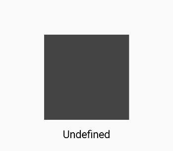
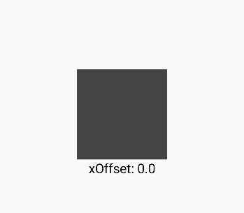
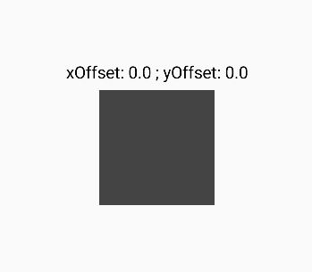

# Обработка жестов

Jetpack Compose предоставляет функционал для работы с распространенными жестами (касание, двойное касание, длительное нажатие и перетаскивание, масштабирование, вращение, смахивание и т.д.). Причем в некоторых случаях Compose предоставляет два способа обнаружения жестов. Один из подходов предполагает использование модификаторов обнаружения жестов. Другой подход - применение функций интерфейса PointerInputScope, которые требуют дополнительного написания кода, но предоставляют более продвинутые возможности работы с жестами.

## Нажатия

Первый подход уже был ранее частично рассмотрен. В частности, с помощью модификатора clickable можно обнаружить касание на компоненте. Этот модификатор принимает функцию (лямбду), которая выполняется при касании/нажатии на компоненте, к которому применяется этот модификатор. Например:
```kotlin
Text(
    "Click",  
    Modifier.clickable { 
        // здесь обработка нажатия 
    }
)
```
Проблема данного модификатора состоит в том, что он не может различать различные типы жестов - касания, нажатия, длинные нажатия и двойные нажатия. Для этого уровня точности нам нужно использовать функцию detectTapGestures() класса PointerInputScope. Эта функция применяется к компоненту через модификатор pointerInput(), который дает нам доступ к PointerInputScope следующим образом:

```kotlin
Text(
    "Click",
    Modifier
        .pointerInput(Unit) {
            detectTapGestures(
                onPress = { /* обработка нажатия */ },
                onDoubleTap = { /* обработка двойного нажатия */ },
                onLongPress = { /* обработка долгого нажатия */ },
                onTap = { /* обработка простого касания */ }
            )
        }
)
```
Рассмотрим небольшой пример:

```kotlin
@Composable
fun TapsExample() {
    var tapType by remember { mutableStateOf("Undefined") }

    Column(
        verticalArrangement = Arrangement.Center,
        horizontalAlignment = Alignment.CenterHorizontally,
        modifier = Modifier.fillMaxSize()) {
        Box(
            Modifier
                .padding(10.dp)
                .background(Color.DarkGray)
                .size(200.dp)
                .pointerInput(Unit) {
                    detectTapGestures(
                        onPress = { tapType = "onPress" },
                        onDoubleTap = { tapType = "onDoubleTap" },
                        onLongPress = { tapType = "onLongPress" },
                        onTap = { tapType = "onTap" }
                    )
                }
        )
        Text(tapType, Modifier.padding(10.dp), fontSize = 25.sp)
    }
}
```
В данном случае по нажатию на темно-сервый квадрат в модиифкаторе pointerInput перехватываем тип нажатия и выводим его в текстовое поле.



## Перетаскивание

Модификатор draggable() позволяет определить жесты перетаскивания на компоненте. Этот модификатор сохраняет смещение (или дельту) движения перетаскивания от исходной точки по мере его возникновения и сохраняет его в состоянии, которое создается с помощью функции rememberDraggableState(). Это состояние затем можно использовать, например, для перемещения перетаскиваемого компонента в соответствии с жестом. Определение функции модификатора:

```kotlin
Modifier.draggable(
    state: DraggableState,
    orientation: Orientation,
    enabled: Boolean = true,
    interactionSource: MutableInteractionSource? = null,
    startDragImmediately: Boolean = false,
    onDragStarted: suspend CoroutineScope.(startedPosition: Offset) -> Unit = {},
    onDragStopped: suspend CoroutineScope.(velocity: Float) -> Unit = {},
    reverseDirection: Boolean = false
)
```
Параметры модификатора:

- state: состояние типа DraggableState, которое хранит информацию об операции перетаскивания.

- orientation: направоение пертаскивания. Может быть горизонтальным (значение Orientation.Horizontal), либо вертикальным (Orientation.Vertical)

- enabled: доступна ли операция перетаскивания

- interactionSource: объект MutableInteractionSource, который будет использоваться для генерации DragInteraction.Start при начале перетаскивания.

- startDragImmediately: если установлено значение true, то перетаскивание начнется немедленно. Предназначено для того, чтобы конечные пользователи могли "поймать" анимируемый компонент, нажав на него.

- onDragStarted: suspend-функция, которая вызывает при начале перетаскивания

- onDragStopped: suspend-функция, которая вызывает после завершения перетаскивания.

- reverseDirection: изменяет направление прокрутки на обратное (прокрутка сверху вниз будет вести себя как снизу вверх, а слева направо — как справа налево).

При вызове модификатора `draggable()` необходимо указать как минимум два параиметра - состояние перемещения и его тип - по горизонтали или по вертикали.

Рассмотрим небольшой пример:

```kotlin
@Composable
fun TapsExample() {
    var xOffset by remember { mutableStateOf(0f) }

    Column( 
        verticalArrangement = Arrangement.Center,
        horizontalAlignment = Alignment.CenterHorizontally,
        modifier = Modifier.fillMaxSize()) {
        Box(
            Modifier
                .offset { IntOffset(xOffset.roundToInt(), 20) }
                .background(Color.DarkGray)
                .size(150.dp)
                .draggable(
                    orientation = Orientation.Horizontal,
                    state = rememberDraggableState { distance ->
                        xOffset += distance
                    }
                )
        )
        Text("xOffset: $xOffset", Modifier.padding(10.dp), fontSize=22.sp)
    }
}
```

В данном примере применяется перетаскивание по горизонтали. Для его отслеживания определяем сначала состояние `xOffset`, затем при помощи этого состояния устанавливается смещение для элемента через соответствующий модификатор, который меняется в функции `draggable()`



 Однако этот модификатор имеет ограничение: одновременно он может использовать либо перетаскивание по горизонтали, либо по вертикали. Функция detectDragGestures() типа PointerInputScope решает эту проблему и позволяет нам одновременно поддерживать операции горизонтального и вертикального перетаскивания. Эта функция имеет следующие параметры:

```kotlin
 suspend fun PointerInputScope.detectDragGestures(
    onDragStart: (Offset) -> Unit = { },
    onDragEnd: () -> Unit = { },
    onDragCancel: () -> Unit = { },
    onDrag: (change: PointerInputChange, dragAmount: Offset) -> Unit
): Unit
```

- onDragStart: функция, которая вызывается при начале перетаскивания

- onDragEnd: функция, которая вызывается после завершения перетаскивания

- onDragCancel: функция, которая вызывается при отмене перетаскивания

- onDrag: функция, которая вызывается при перетаскивания

      
```kotlin
@Composable
fun TapsExample() {
    var xOffset by remember { mutableStateOf(0f) }
    var yOffset by remember { mutableStateOf(0f) }

    Column( 
        verticalArrangement = Arrangement.Center,
        horizontalAlignment = Alignment.CenterHorizontally,
        modifier = Modifier.fillMaxSize()) {
        Text("xOffset: $xOffset ; yOffset: $yOffset", Modifier.padding(10.dp), fontSize=22.sp)
        Box(
            Modifier
                .offset { IntOffset(xOffset.roundToInt(), yOffset.roundToInt()) }
                .background(Color.DarkGray)
                .size(150.dp)
                .pointerInput(Unit) {
                    detectDragGestures { _, distance ->
                        xOffset += distance.x
                        yOffset += distance.y
                    }
                }
        )
    }
}
```

Для отслеживания перетаскивания как по горизонтали, так и по вертикали, определяются две переменных состояния для хранения смещений по оси X и Y. К их значениям привязаны координаты компонента Box. В лямбда-выражение в функции detectDragGestures передается параметр distance, который представляет объект Offset и из которого мы можем получить последние значения смещения перетаскивания по осям x и y. Они добавляются к состояниям xOffset и yOffset соответственно, в результате чего компонент Box следует за движением перетаскивания по экрану

